# DMZ.zip在vulfocus场景管理上传失败的手动搭建复刻指南OvO

## 实验环境

* VirtualBox 虚拟机 7.0.14
* 主机配置：

| 主机 | 系统版本 | ip地址 |
| ----- | ----- | ----- |
| kali-victim | kali-linux-2024.2 | 192.168.146.8 |
| kali-attacker | kali-linux-2024.2 | 192.168.146.11 |

## 搭建过程

- 虚拟机中启动```docker```，在浏览器中打开IP地址，```场景管理```-```环境编排管理```-```添加场景```-```创建编排模式```-```上传```-```选择DMZ.zip```，报错```文件上传失败```：

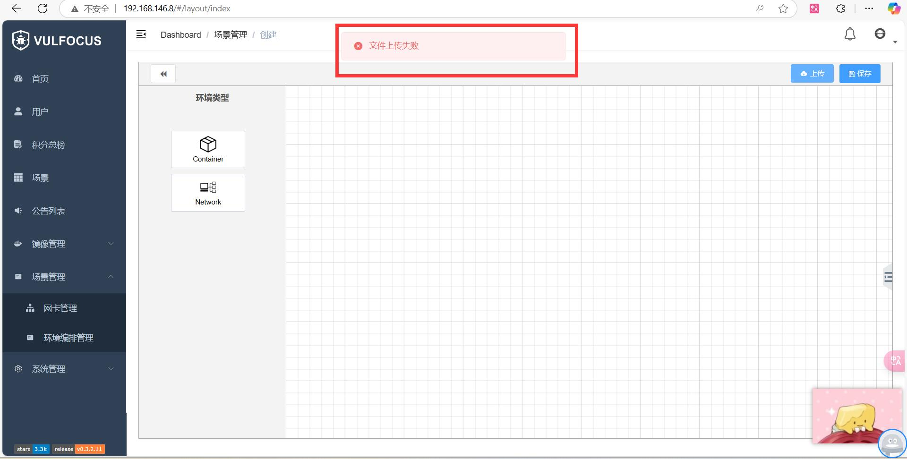

- 开始手动复刻，看到视频内的镜像名称显示不全

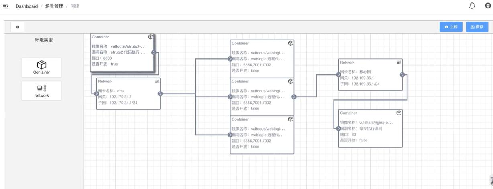

- 将```DMZ.zip```解压缩，可以看到有三个文件
    - 可以作为封面上传的jpg文件
    - 包含场景名称和描述的文件```layout_info.json```
    - 包含场景内部各种配置的文件```raw-content.json```

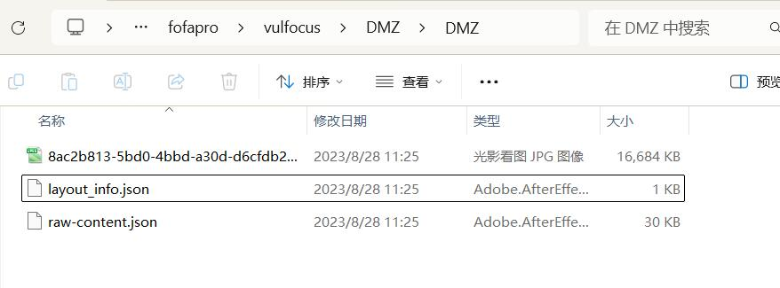

- 打开```raw-content.json```，可以找到需要的三个镜像全名：

```
"vul_name": "weblogic 远程代码执行 (CVE-2019-2725)", "name": "vulfocus/weblogic-cve_2019_2725:latest"
"vul_name": "struts2 代码执行 （CVE-2020-17530）", "name": "vulfocus/struts2-cve_2020_17530:latest"
"vul_name": "命令执行漏洞", "name": "vulshare/nginx-php-flag:latest"
```

- 回到```vulfocus```，```镜像管理```-```镜像管理```手动搜索并下载上述三个镜像并等待安装完毕。

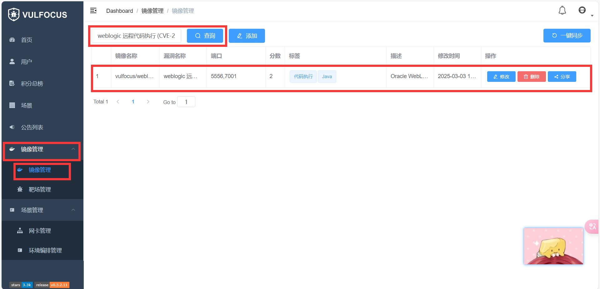

- 等待同时可以```场景管理```-```网卡管理```，添加两张网卡如下（注意：子网与视频内填写方式略有不同）

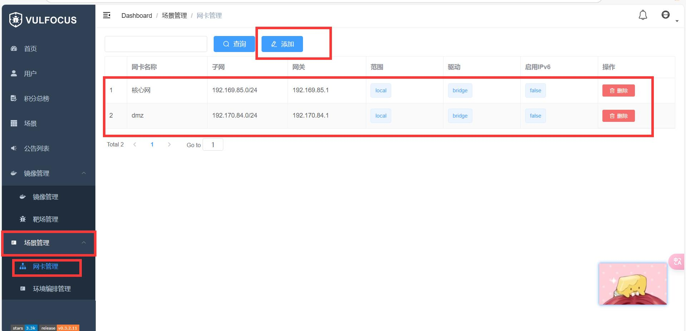

- 以上两步完毕后就可以回到```场景管理```-```环境编排管理```-```添加场景```-```创建编排模式```

- 将需要的环境拖入画布

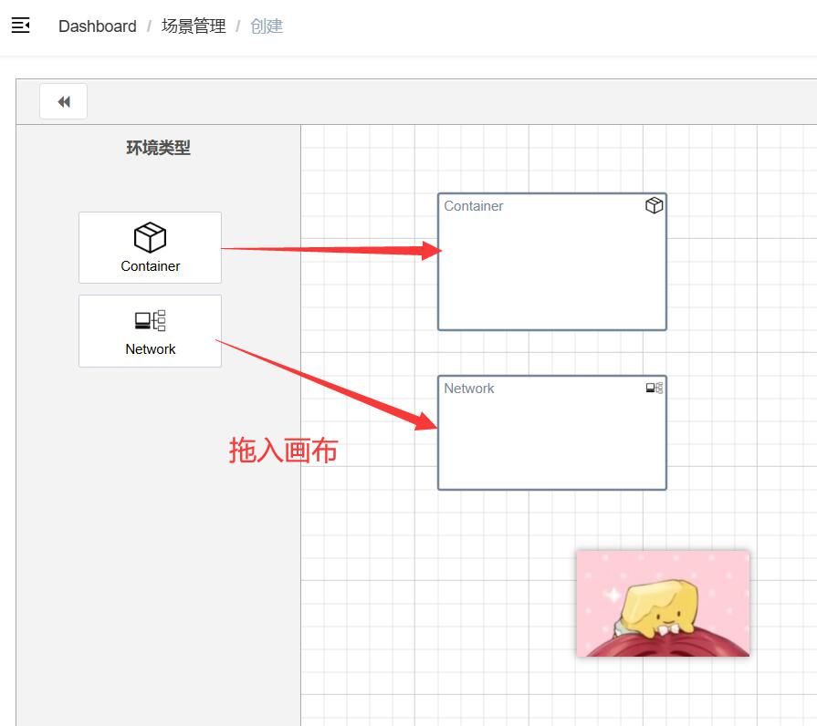

- 选中环境，点击画布右侧小标识，即可打开选项卡，在选项卡中选择配置对应的镜像和设置等

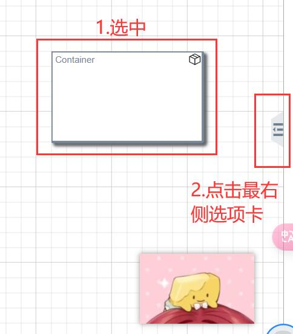

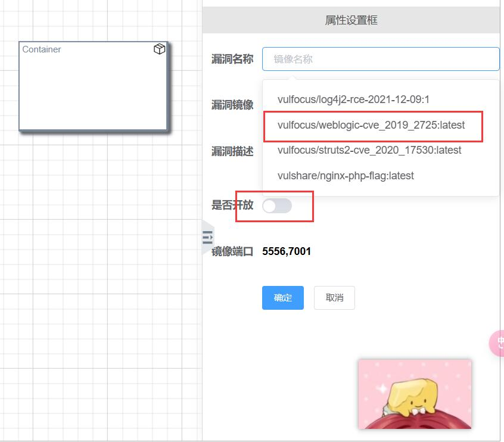

- 将光标移动到环境选项卡上会显示箭头，长按并按需求连线即可

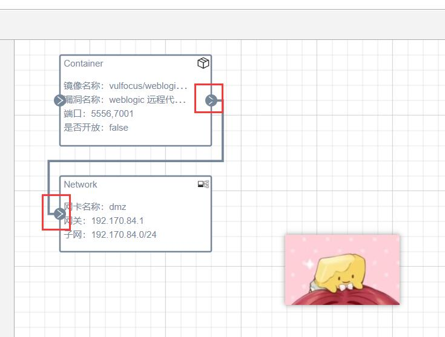

- 最终连接好是这样

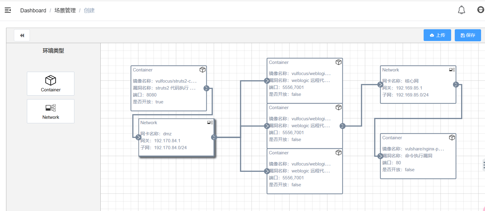

- 右上角保存，填入```环境名称```、```环境描述```和```banner图```，确定后会返回```环境编排管理```页面，就已经可以看到做好的场景了。

- 点击右下角发布，即可在```vulfocus```的场景中看到

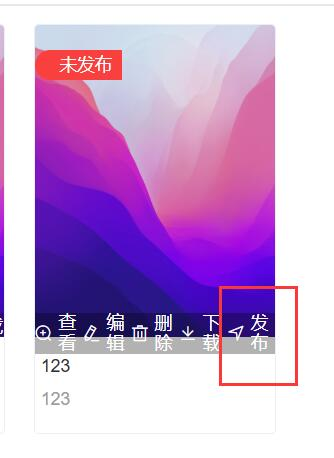

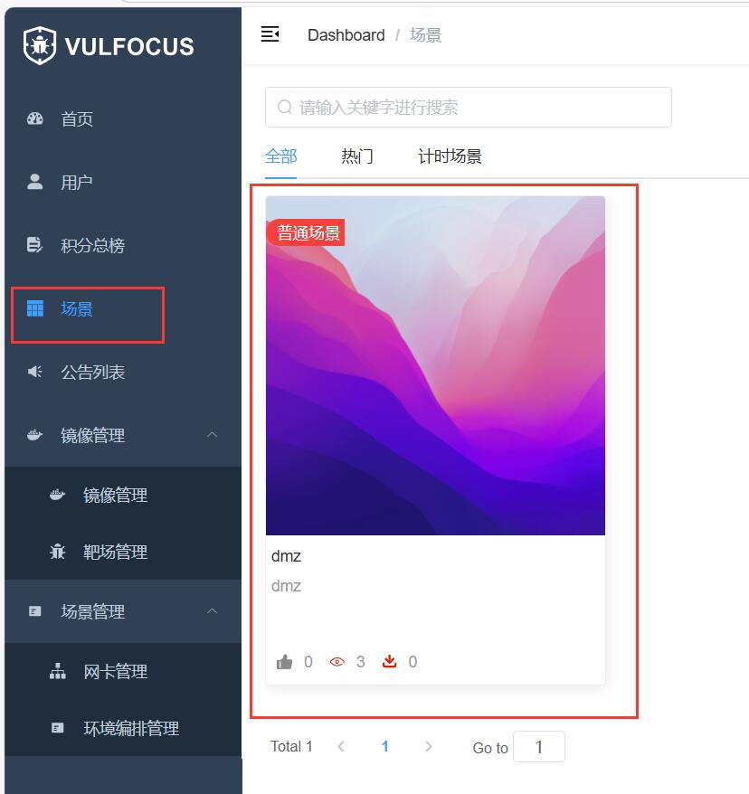

- 后续操作需要启动场景就可以从这里点进去启动啦✿✿ヽ(°▽°)ノ✿