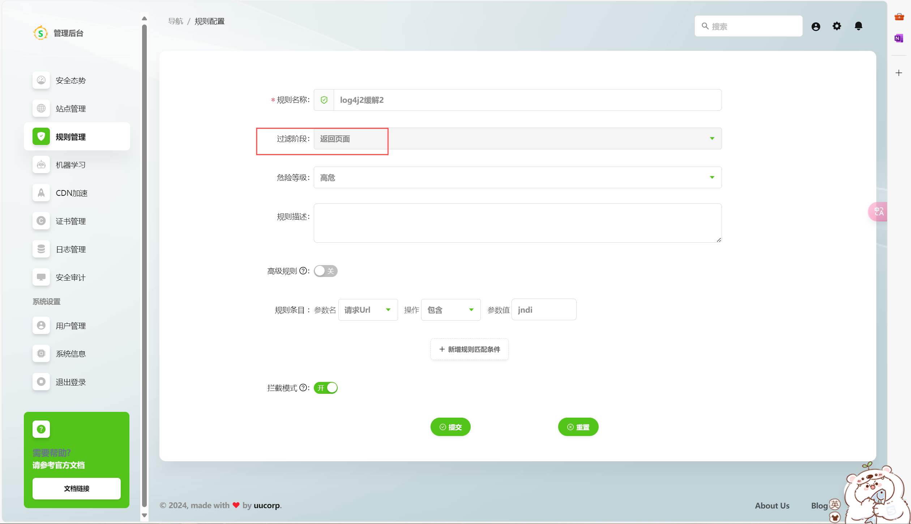
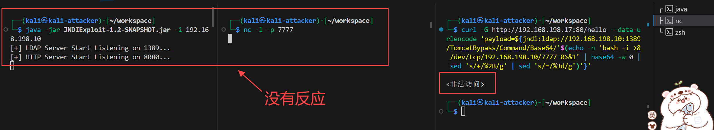
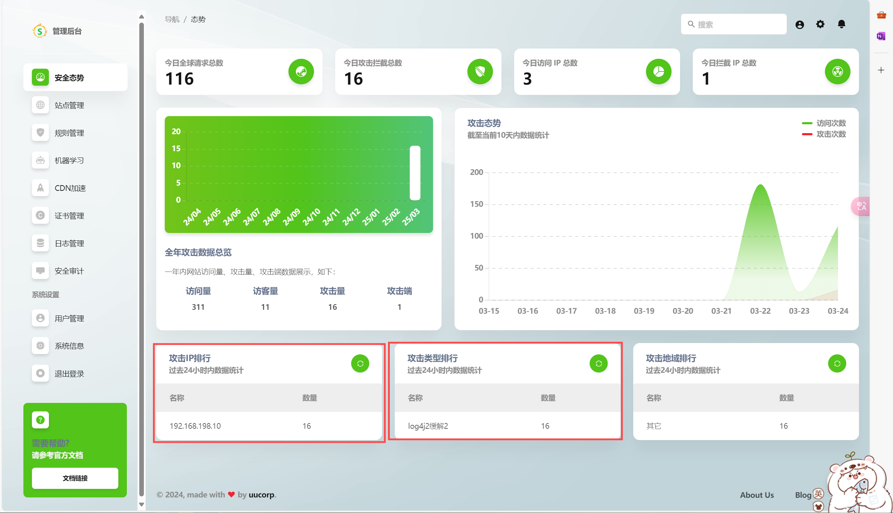
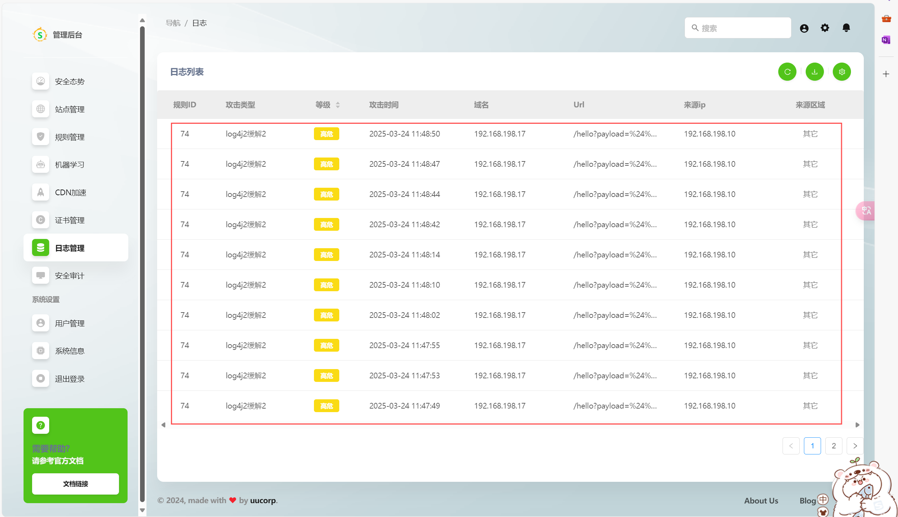
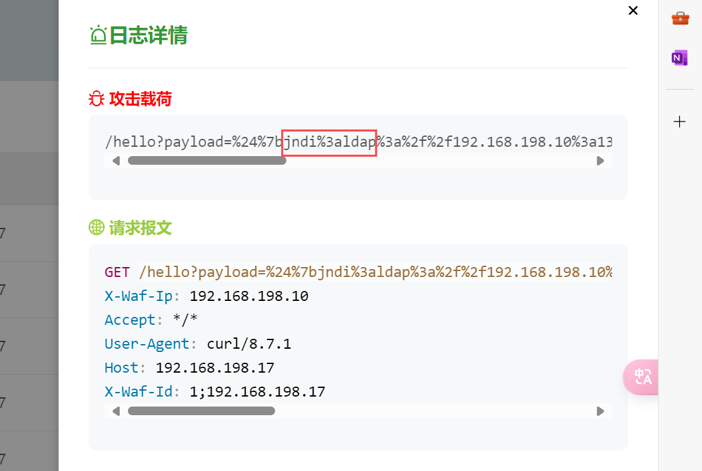
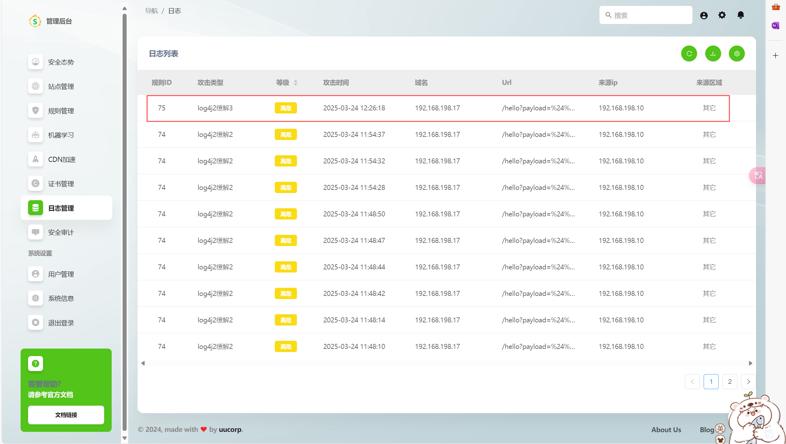

# log4j2 漏洞缓解完成

1. 流量转发设置理论上应该是正确的，WAF 站点上游地址也正确设置了，那么问题可能出现在 WAF 规则上。

   - 新建了一个规则，将过滤阶段由`请求页面`阶段改为`返回页面`阶段，保存设置。
   

   - 再次进行带有 `jndi` 参数的 curl 请求，返回了我们自定义的拦截页面，同时反弹 bash 失败，所以可以确定拦截成功，log4j2 缓解成功。
   

   - 查看 WAF 首页，可以看到我们测试了十六次，都被拦截了，且均有日志记录。
   

   - 从日志管理可以查看详细的拦截攻击日志信息：
   

   - 点开其中一条日志，可以看到拦截的攻击载荷情况以及请求的报文信息便于我们分析攻击的具体情况。
   

   - 再次尝试，将规则设置的过滤阶段修改为 `返回HTTP头`。
   

   - WAF 仍可拦截成功。
   

2. 我猜测请求阶段的拦截规则没有生效，可能是因为在返回HTTP头或返回页面阶段，WAF可以获取到完整的上下文信息。此时，WAF不仅能检测请求内容，还能结合服务器的响应内容进行综合分析。因此想要拦截恶意攻击，应当设置全面的拦截规则，而不是只看一方面。